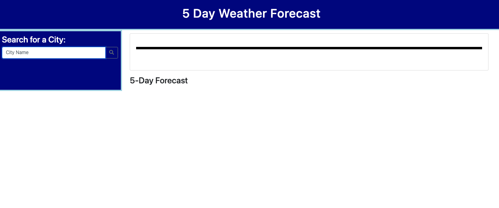
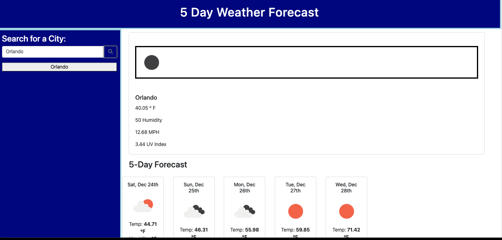
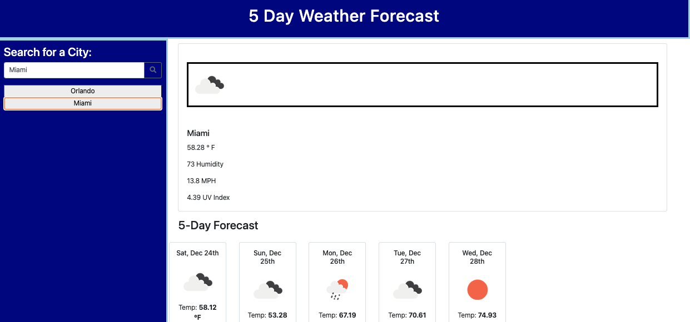

# 5-day-weather-forecast
An API to provide the 5-day weather forecast

## Description

The motivation behind this API is to pull the current and next 5 day weather forecast. This project helps to learn to use the weather API to access the data from a server and bring it back into the webpage. This project took a lot of getting used to getting data from a server. Being able to access the data and them placing it onto a page with several functions while not breaking the code.

## Installation

font awesome : https://kit.fontawesome.com/9d317aec20.js

bootstrap : https://maxcdn.bootstrapcdn.com/bootstrap/4.0.0/css/bootstrap.min.css

jquery : https://code.jquery.com/jquery-3.4.1.min.js

## Usage

Main Screen

First Search

Second Search (Creates clickable List of Buttons)

## MIT License

MIT License

Copyright (c) 2022 Gerardo

Permission is hereby granted, free of charge, to any person obtaining a copy
of this software and associated documentation files (the "Software"), to deal
in the Software without restriction, including without limitation the rights
to use, copy, modify, merge, publish, distribute, sublicense, and/or sell
copies of the Software, and to permit persons to whom the Software is
furnished to do so, subject to the following conditions:

The above copyright notice and this permission notice shall be included in all
copies or substantial portions of the Software.

THE SOFTWARE IS PROVIDED "AS IS", WITHOUT WARRANTY OF ANY KIND, EXPRESS OR
IMPLIED, INCLUDING BUT NOT LIMITED TO THE WARRANTIES OF MERCHANTABILITY,
FITNESS FOR A PARTICULAR PURPOSE AND NONINFRINGEMENT. IN NO EVENT SHALL THE
AUTHORS OR COPYRIGHT HOLDERS BE LIABLE FOR ANY CLAIM, DAMAGES OR OTHER
LIABILITY, WHETHER IN AN ACTION OF CONTRACT, TORT OR OTHERWISE, ARISING FROM,
OUT OF OR IN CONNECTION WITH THE SOFTWARE OR THE USE OR OTHER DEALINGS IN THE
SOFTWARE.

